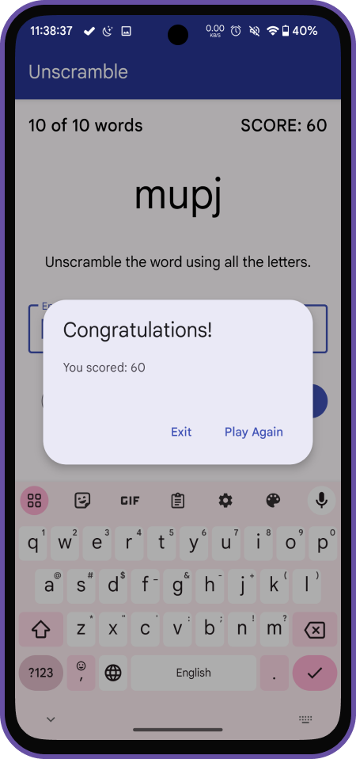

# GoogleCodelabsApps

A collection of Android projects from Google Codelabs

# DiceRoller🎲

**Created on: 2022.10.29**

One of the first apps I created when I was just starting to learn Android development. The app is
really simple, just consists of one Activity.
App that lets users roll a virtual dice with the click of a button.

    

# Unscramble

**Created on: 2023.11.22**

The Unscramble app is a single player word scrambler game. The app displays one scrambled word at a time, and the player
has to guess the word using all the letters from the scrambled word. The player scores points if the word is correct,
otherwise the player can try any number of times. The app also has an option to skip the current word. In the left top
corner, the app displays the word count, which is the number of words played in this current game. There are 10 words
per game.

  
  
  

# CupCake

**Created on: 2023.11.26**

This app contains an order flow for cupcakes with options for quantity, flavor, and pickup date. The order details get
displayed on an order summary screen and can be shared to another app to send the order.

This app demonstrates multiple fragments in an activity, a shared ViewModel across fragments, data binding, LiveData,
and the Jetpack Navigation component.

  
  
  
  

# Sports

**Created on: 2023.12.10**

Sports app is a basic app to introduce adaptive layouts. This app consists of two fragments: a
sports topics list and a details screen. The details screen displays placeholder text for the sports news. This app
demonstrated the use of SlidingPaneLayout.

  
  

  
  

# Lunch Tray

**Created on: 2023.12.12**

In this project, I leveraged the skills learned in Unit 3 to build out a lunch ordering app called Lunch Tray,
implementing a view model, data binding, and navigation between screens.

  
  
  
  

# Mars Photos

**Created on: 2023.12.18**

MarsPhotos is a demo app that shows actual images of Mar's surface. These images are real-life photos from Mars captured
by NASA's Mars rovers. The data is stored on a Web server as a `REST` web service. This app demonstrated the use of
Retrofit to make `REST` requests to the web service, `Moshi` to handle the deserialization of the returned `JSON` to
Kotlin
data objects, and `Coil` to load images by `URL`.

The app also leverages `ViewModel`, `LiveData`, and `DataBinding` with binding adapters.

  
  
  
  

# Amphibians

**Created on: 2023.12.25**

The app that displays information about different amphibian species, and uses networking, JSON parsing,
and view models to enable the app to use data from the network.
The app gets its data from a custom API for this
project and displays it in a list view.

In the app, the first screen the user will see displays the names of each species in a recycler view.
Tapping a list item navigates to the detail screen which also displays the species' name as well as a detailed
description.

  
  
  

# Bus Scheduler

**Created on: 2023.12.28**

The Bus Scheduler app displays a list of bus stops and arrival times. Tapping a bus stop on the first screen will
display a list of all arrival times for that particular stop.

The bus stops are stored in a Room database. Schedule items are represented by the Schedule class and queries on the
data table are made by the ScheduleDao class. The app includes a view model to access the ScheduleDao and format data to
be display in a list, using Flow to send data to a recycler view adapter.

  
  

# Inventory

**Created on: 2023.12.30**

This app is an Inventory tracking app. Demos how to add, update, sell, and delete items from the local database. This
app demonstrates the use of Android Jetpack component Room database.

The app also leverages ViewModel, LiveData, Flow, View Binding, and Navigation with the SafeArgs plugin for parameter
passing between fragments.

  
  
  
  

# DevBytes

**Created on: 2024.01.02**

DevByteRepository app displays a list of DevByte videos. DevByte videos are short videos made by the Google Android
developer relations team to introduce new developer features on Android. This app demonstrates the Repository pattern,
the recommended best practice for code separation and architecture. Using repository pattern the data layer is
abstracted from the rest of the app. Repositories act as mediators between different data sources, such as persistent
models, web services, and caches and the rest of the app.

  
  

# Forage

**Created on: 2024.01.05**

The Forage app allows users to keep track of items, food, for example, that they've foraged for in nature. This
data is persisted between sessions using Room.

When the app is first launched, the user is presented with an empty screen containing a recycler view that will display
foraged items, as well as a floating button in the bottom right corner to add new items.

When adding a new item, the user can specify a name, the location where it was found, as well as some additional notes.
There's also a checkbox for whether the food item is currently in season.

Once an item has been added, it will appear in the recycler view on the first screen.

Tapping an item leads to a detail screen which shows the name, location, and notes.

The floating button also changes from a plus symbol to an edit icon. Tapping this button leads to a screen that lets you
edit the name, location, notes, and "in season" checkbox. Tapping the delete button will remove the item from the
database.

  
  
  
  

# Work Manager

**Created on: 2024.01.06**

